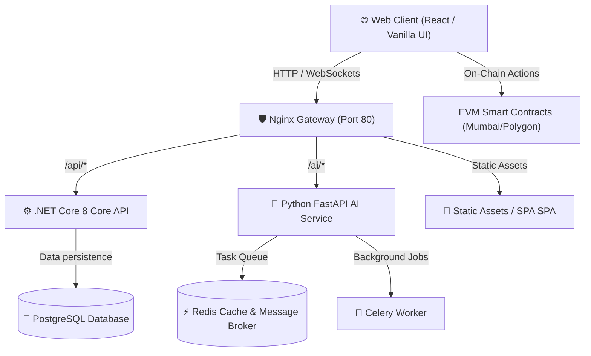

# 🌐 AIToolHub DAO

[](https://opensource.org/licenses/MIT)
[](https://www.docker.com/)
[](https://react.dev/)
[](https://dotnet.microsoft.com/)
[](https://fastapi.tiangolo.com/)
[](https://soliditylang.org/)

A decentralized autonomous organization (DAO) platform for community-governed AI tools. Users can propose new AI tools, vote on proposals using governance weight (AIT tokens), interact with hosted AI microservices, and co-own community resources.

---

## 🛠️ Architecture Overview

The platform uses a modern microservices architecture coordinated via a centralized Nginx gateway. The systems communicate through REST APIs, real-time WebSockets (SignalR), and on-chain smart contracts.



---

## ✨ Core Features

*   **🎮 Premium UI/UX:** A stunning glassmorphic dashboard with a dark/light theme system, responsive tables, real-time stats, and a custom interactive **DotField** particle grid background that reacts dynamically to mouse movement.
*   **🗳️ On-Chain Governance:** Fully compatible with Solidity governance architectures. Propose new AI features, lock tokens, and cast votes on-chain.
*   **🤖 Hosted AI marketplace:** Spin up and query community-built AI microservices (FastAPI + Celery + Python) directly from the dashboard.
*   **📈 Real-time Activity Feed:** Live dashboard tracking updates, transaction logs, and voter actions powered by WebSockets.
*   **💼 Mock Wallet Simulator:** Connect and interact with a mock wallet interface for quick demo runs without configuring Metamask or spending gas.

---

## 📂 Project Structure

```bash
aitoolhub-dao/
├── aitoolhub-frontend/     # Web Frontend (Vite, React components, and served Vanilla client)
│   ├── public/             # Production build served by Nginx (HTML, CSS, JS)
│   └── src/                # React source code & tools integration
├── aitoolhub-api/          # Core ASP.NET Core 8 REST API (C#)
│   ├── Controllers/        # Endpoints (Auth, Proposals, Tools, Treasury)
│   ├── Models/             # Entity Models (PostgreSQL mappings)
│   └── Services/           # Core Business Logic & SignalR Hubs
├── aitoolhub-ai/           # Python FastAPI microservice
│   ├── main.py             # Model APIs & Health routes
│   └── requirements.txt    # Python dependencies
├── aitoolhub-contracts/    # EVM Smart Contracts (Solidity + Hardhat)
│   ├── contracts/          # Solidity files (DAOGovernance.sol)
│   └── scripts/            # Deployment & testing utilities
├── docker-compose.yml      # Orchestrates all platform containers
└── nginx.conf              # Reverse proxy configuration
```

---

## 🚀 Quick Start (Docker Compose)

The fastest and most reliable way to spin up the entire application is via Docker Compose.

### Prerequisites
*   [Docker Desktop](https://www.docker.com/products/docker-desktop/) installed and running.
*   Port `80`, `3000`, `5000`, `8000`, and `5432` free on your local machine.

### Instructions

1.  **Clone the Repository:**
    ```bash
    git clone https://github.com/your-username/aitoolhub-dao.git
    cd aitoolhub-dao
    ```

2.  **Configure Environment Variables:**
    Create a `.env` file in the root directory by copying the sample template:
    ```bash
    cp .env.example .env
    ```
    *Open the `.env` file and configure your keys, JWT secrets, and contract deployment wallet credentials.*

3.  **Launch the Services:**
    ```bash
    docker-compose up --build -d
    ```

4.  **Restart Nginx Proxy:**
    Restart Nginx once to ensure container hostnames resolve correctly:
    ```bash
    docker-compose restart nginx
    ```

### 🔗 Services & Endpoint Mapping

| Service | Protocol / Port | Access URL |
| :--- | :---: | :--- |
| 🌐 **Frontend Application** | HTTP / `80` | [http://localhost](http://localhost) |
| ⚙️ **.NET API (Swagger Docs)** | HTTP / `5000` | [http://localhost:5000/swagger](http://localhost:5000/swagger) |
| 🧠 **FastAPI AI Docs** | HTTP / `8000` | [http://localhost:8000/docs](http://localhost:8000/docs) |

---

## 🛠️ Local Development (Without Docker)

If you need to work on individual services locally without running Docker, spin them up individually:

### 1. Python AI Service
```bash
cd aitoolhub-ai
python -m venv .venv
source .venv/bin/activate       # On Windows use: .venv\Scripts\activate
pip install -r requirements.txt
uvicorn main:app --host 0.0.0.0 --port 8000 --reload
```

### 2. ASP.NET Core API
Ensure you have the [.NET 8 SDK](https://dotnet.microsoft.com/en-us/download/dotnet/8.0) installed:
```bash
cd aitoolhub-api
dotnet restore
dotnet run
```

### 3. Frontend Web Server
Ensure you have [Node.js](https://nodejs.org/) installed:
```bash
cd aitoolhub-frontend
npm install
npm run dev
```

### 4. Smart Contracts (Hardhat)
```bash
cd aitoolhub-contracts
npm install
npx hardhat compile
npx hardhat test
npx hardhat run scripts/deploy.js --network mumbai
```
## ⚙️ Environment Configuration

Ensure your `.env` contains the following keys for operational production deployments:

```ini
# Core API Configurations
Jwt__Secret=YOUR_JWT_SIGNING_SECRET_MIN_32_CHARS

# Web3 Deployments
PRIVATE_KEY=YOUR_DEPLOYER_WALLET_PRIVATE_KEY
POLYGONSCAN_API_KEY=YOUR_POLYGONSCAN_API_KEY
```

---

## 💡 Troubleshooting

*   **Nginx Routing Issues (`Bad Gateway`):**
    If the website loads but the charts/proposals fail to fetch, Nginx is struggling to resolve upstream container IP addresses. Simply run:
    ```bash
    docker-compose restart nginx
    ```
*   **Docker Daemon Connection Failure:**
    Make sure Docker Desktop is fully loaded and running before executing compose scripts.
*   **Database connection failures:**
    Ensure database containers have fully completed health checks and migrations on spin-up before calling APIs. Check status using `docker-compose ps`.

---

## 📄 License

Distributed under the MIT License. See [LICENSE](LICENSE) for more details.